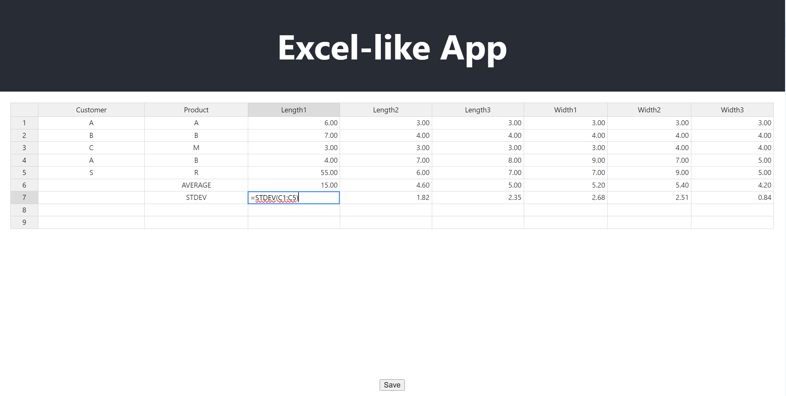

# Demo Table Application (Backend)

This project implements the backend for an Excel-like table application using FastAPI and SQLAlchemy with PostgreSQL.

## Features

- RESTful API for data operations
- PostgreSQL database for data storage
- Statistical calculations (average, standard deviation)

## Project Structure
```
Demo/
│
├── .venv/                 # Virtual environment (not tracked by git)
├── alembic/               # Database migration files
│   └── versions/          # Migration version files
├── api/
│   └── endpoints.py       # API route definitions
├── db/
│   └── database.py        # Database connection and session management
├── frontend/              # Frontend application
├── models/
│   └── models.py          # SQLAlchemy ORM models
├── schemas/
│   └── schemas.py         # Pydantic models for request/response validation
├── alembic.ini            # Alembic configuration file
├── main.py                # FastAPI application entry point
├── requirements.txt       # Project dependencies
└── test_api.py         # pytest tests for the API
```

## Setup

1. Clone the repository: 
  ```
   git clone https://github.com/fy658/Demo.git
  ```
2. Navigate to the project directory: 
  ```
   cd Demo
  ```
3. Create a virtual environment: 
   Python version: 3.12, 
   other version may lead to install package error
  ```
   python -m venv venv
  ```
4. Activate the virtual environment:
- On Windows: 
  ```
  venv\Scripts\activate
  ```
- On macOS and Linux: 
  ```
  source venv/bin/activate
  ```
5. Install dependencies:
  ```
  pip install -r requirements.txt
  ```
6. Set up PostgreSQL:
- create new database `handle_data` in PostgreSQL using the following command:
  ```
  CREATE DATABASE handle_data;
  ```
- connect your database using the following database connection parameters:
  ```
  user: postgres
  password:123456
  dbname:handle_data
  ```
- Configure your database connection URL in `alembic.ini` and `db/database.py`
- Run database migrations:
  ```
  alembic upgrade head
  ```
7. Run the application:
  ```
  uvicorn main:app --reload
  ```

The server will start at `http://localhost:8000`.

## API Documentation

Once the server is running, you can access the automatic API documentation:

- Swagger UI: `http://localhost:8000/docs`
- ReDoc: `http://localhost:8000/redoc`

## Frontend set up

1. Navigate to the frontend directory: 
  ```
   cd frontend
  ```
2. Install dependencies: 
   Nodejs version:  16.16.0
   ```
    npm install
   ```
3. Start the development server:
   ```
    npm start
   ```
The application will be running at `http://localhost:3000`, the UI in browser like below picture:


This application demonstrates an Excel-like interface built using HandsonTable and powered by HyperFormula for calculations.



## How to Use in frontend UI:

1. Data Entry and Manipulation:
   - You can operate with data just like in Excel, entering information into one or multiple rows.
   - Click the button to save you data you input.

2. Formula Application:
   - After inputting a formula, you can drag it horizontally or vertically, just as in Excel.
   - This action will automatically apply the formula to subsequent cells, calculating results based on the relative references.

For example:
- Enter a formula like `=AVERAGE(C1:C5)` in cell C6.
- Click and drag the bottom-right corner of cell C6 down to apply the formula to cells C7, C8, etc.
- The app will adjust the cell references automatically (e.g., C7 will contain `=AVERAGE(C2:C6)`).

This functionality allows for quick and efficient data analysis and calculation across your spreadsheet.

## Testing

You can use the `test_api.py` file to test the API endpoints. This file is compatible with REST Client extensions in various IDEs.
you can run the tests with:
  ```
  pytest test_api.py
  ```


## License

This project is licensed under the [MIT License](LICENSE).
